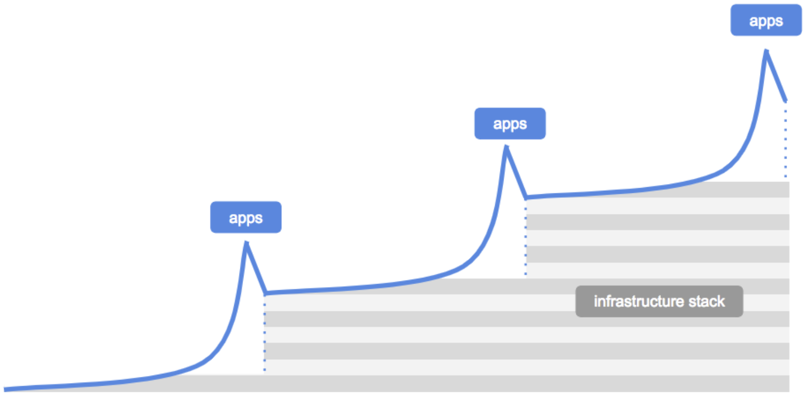
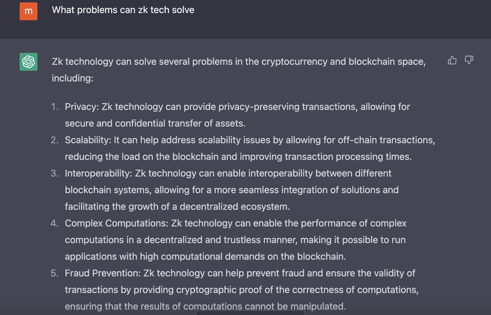
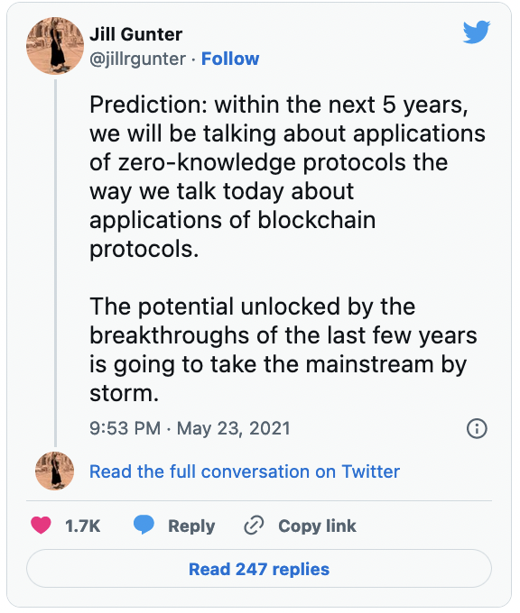

Excited to announce that I have joined RISC Zero as the VP of product growth. 
We are building a general-purpose [zkVM](../../docs/explainers/zkvm/) and ushering the wave of ZK compute for all!

If you know me, you know I have done my research! 
As I explored my next career move, I scanned the entire crypto landscape and had conversations with numerous companies. 
I am most excited about DeFi's potential to solve real financial challenges, DAOs as revolutionary coordination mechanisms, and decentralized infrastructure (storage, compute, identity, etc.) as essential building blocks for disintermediation. 

The 2020-22 period brought significant growth in the crypto industry, attracting widespread attention and new talent. 
The rising popularity of DAOs, the explosion of DeFI applications, and the NFT boom were all made possible by the previous cycles of infrastructure building. 
But very quickly, we hit scaling barriers, exposing the gaps in our infrastructure.

Bear markets give us the space to build infra needed for the next wave of adoption. 
We are again in the infrastructure part of the app-infra cycle for crypto. 

*Refer this USV piece on [the myth of infrastructure.](https://www.usv.com/writing/2018/10/the-myth-of-the-infrastructure-phase/)*

And today’s infrastructure will bring tomorrow’s killer app.

One thing I knew for sure: I wanted to work on something that truly moves the needle for crypto use cases and adoption. 
Having worked on decentralized storage infra for the last 3.5 years, I have witnessed first-hand the difficulties developers encounter when building complex real-world applications on-chain. 

ZK tech is uniquely positioned to address the challenges facing crypto infrastructure today by enabling verifiable complex computations off-chain. Here’s an explanation from ChatGPT’s 😎

In the past six months, there have been remarkable advancements, resulting in a surge of teams developing ZK scaling solutions. 
ZK protocols and applications enabled by ZKPs are still in their infancy, and the excitement is only going to be multifold this year. 
If we can harness the potential of ZK and make it available to developers of all levels, we can open up a whole new realm of previously impossible applications. 
Jill Gunter predicted ZKP applications becoming the norm. I think we will be seeing it sooner than 2026!

Building ZK circuits, leveraging ZKPs, and building ZK applications is no small feat! 
Requires millions of dollars of investments, assembling a team of rare crypto and math experts, and learning new custom programming languages with inadequate tooling. 

Enter RISC Zero!

RISC Zero is removing these resource and time-intensive barriers by bringing existing languages, tools, and developer skills to ZKP development. 
Built on the open RISC-V instruction set, RISC Zero’s zkVM will enable developers to generate highly performant ZKPs for a variety of applications with code written in Rust, C++, Solidity, Go, and more. 

When choosing my next project, my top priority was the *people* involved and the potential *impact* it would make. 
One of the best things about joining RISC Zero is its team of brilliant individuals with decades of experience across distributed systems, cryptography, security, and cloud computing. 
The combination of technical expertise and genuine kindness is truly rare!

RISC Zero will play a key role in ushering in the era of verifiable computing. 
We are bringing trusted computing into trustless environments. 
And I couldn’t be more excited to work on this alongside Brian Retford, Jeremy Bruestle, Choong Ng, Frank Laub, Ash Schap, and the rest of the team.

If you haven’t guessed already, I am totally ZK pilled. 
And you will be too! 
I will be posting accessible ZK content, so join me in this journey [@manasilvora](https://twitter.com/manasilvora). 

HMU if you want to chat ZK or are building an L2 rollup, appchain, dapp, or an L1 that wants to leverage ZK tech!

Alright, back to building!